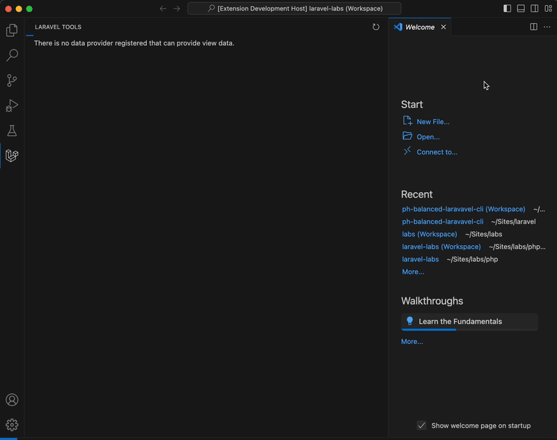
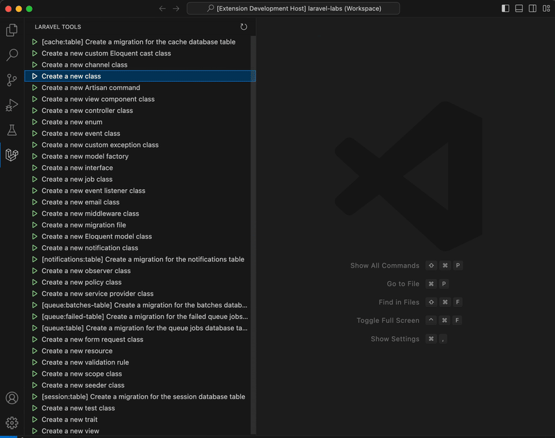
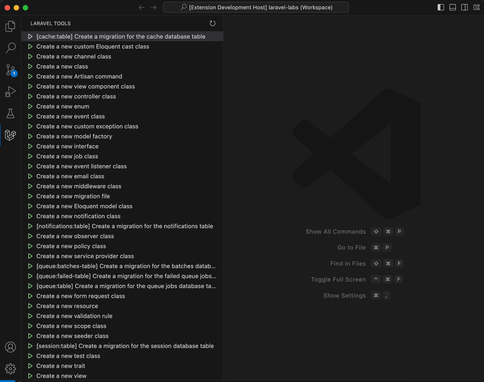

# Artisan Tools README

Artisan Tools is a Visual Studio Code extension that provides a set of tools to enhance your Laravel development experience. This extension includes features such as running artisan make commands directly from the sidebar.

> [!IMPORTANT]
I have been using Laravel for ten years, and started this extension locally and wanted to give back to the community.
This is *not* approved, sponsored, or affiliated by the good people who make Laravel and I have no monetary stake in this. Laravel is trademarked see: https://laravel.com/trademark - there is no commercial use implied in this extension. This is simply to pay it forward for folks who may need to have a comprehensive list of things to do in artisan make or have accessibility issues with using the command line.

## Features

- **Artisan Commands Sidebar**: View and run Laravel artisan commands directly from the VS Code sidebar.
- **Command Execution**: Easily execute artisan commands without leaving your editor.

### Screenshots

<figure>
  
  <figcaption>Initializing Commands in Workspace</figcaption>
</figure>

<figure>
  
  <figcaption>Using make:class to create a new class</figcaption>
</figure>

<figure>
  
  <figcaption>Feedback if a command fails to run</figcaption>
</figure>

## Requirements

- Composer
- PHP installed on your system.
- A Laravel project with the `artisan` file in the root directory.

## Usage

1. Open a Laravel project in Visual Studio Code.
2. Open the Command Palette (`Cmd+Shift+P`) and run `Run Bash Script`.
3. The sidebar will populate with available artisan commands.
4. Click on any command to execute it.

## Contributing

Contributions are welcome! Please open an issue or submit a pull request on GitHub.

## License

This extension is licensed under the MIT License.